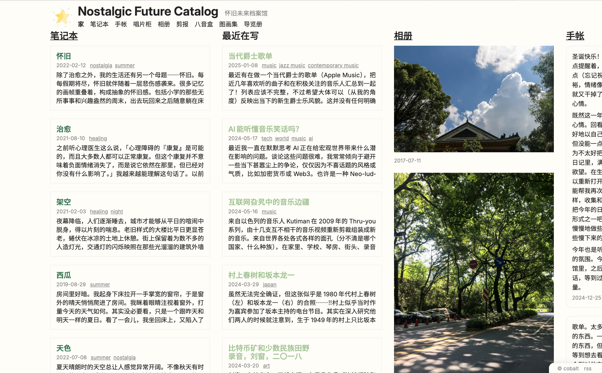

# Nostalgic Future Catalog

An experimental personal blog built from scratch with the static site generator [`lume`](https://lume.land) for the next generation JavaScript/TypeScript runtime [`Deno`](https://deno.com).

## Features
- The main contents are my posts, journals (logs), musical album collections, photos, bookmarks (clips), self-made tracks and illustration collections.
- Homepage with featured and recent contents in TweetDeck-inspired ([RIP](https://bymattruff.com/2023/08/16/rip-tweetdeck-2008-2023/)) multi-column layout.
- The technical motivation of building this site is to learn to build a website from scratch without relying on popular heavy frameworks like React. So only 6 lines of JavaScript is used in the built site (to persist a toggle's state). Modern HTML/CSS and static site generator gives us enough power to build a plain but rich, elegant and flexible site.
- Custom Chinese/Japanese/Korean (CJK) typesetting to complement [the slow progress of CSS implementation](https://wpt.fyi/results/css/css-text/text-spacing-trim?label=experimental&label=master&aligned), including proper punctuation squeezing, inter-script space, vertical writing mode, text grid constraint and mixed script typography. Many codes are borrowed from a great CJK typesetting library [Tategaki](https://github.com/Denkiame/Tategaki). The main reference is W3C Editor's Draft [Requirements for Chinese Text Layout](https://www.w3.org/International/clreq/).
- For easier browsing, entities can be grouped by categories/tags in note, log, album and clip sections.

## Structure
- `src/`
  - `_includes`: Most of the reusable components and layouts written in Nunjucks.
  - `_data/site.yml`: Global data of the site including title, navigation links and featured contents.
  - `index.njk`: Homepage layout.
  - `style/index.css`: Global CSS for all important styling.
  - And other section directories.
- `_config.ts`: Lume config file for setting up plugins such as RSS feed generator and image transformation. Custom filters and preprocessors are also defined in this file.
- `_extra/cjk.ts`: Codes for CJK typesetting.

## Mechanisms
There are roughly 2 ways to drive site generation: (1) generate from a set of Markdown files with metadata; (2) generate from a JSON/YAML file representing all the entities (located at `*/_data` directory), which can be accessed by a Nunjucks template or a dynamic JavaScript page (`*.page.js`). Besides, `*/_data.yml` files often contain important information for the corresponding section such as categories and tags.

Unless explicitly specified in the template/page file, the URL of a page is derived from the original directory structure.
